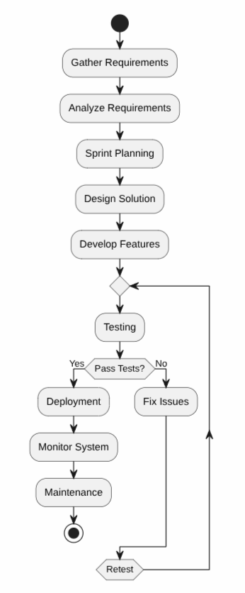

# Sprint Deliverable Documentation

**Project Name:** JustToDoIt

**Course:** Desarrollo e implantación de sistemas de software

**Team Members:** 
- Gustavo Garcia
- Juan Pablo Gil
- Juan Pablo Torres
- Maria Guadalupe Soto

**Sprint Number:** Sprint 5

**Submission Date:** 11 of June 2026

---

# Table of Contents

1. Project Overview
2. User Guide
3. Release Notes
4. Software Development Process
5. UML Activity Diagram
6. References

---

# 1. Project Overview

## Project Description

The purpose of JustToDoIt is to offer employees dynamic and innovative ways to track their tasks offering Telegram's Chat Bots and a state-of-the-art web page. Aside from this it offers unique features such as AI KPI analyzer and KPI advanced visualization.

### Objectives

- **Improve task management efficiency** by providing employees with dynamic and user-friendly tools for tracking, organizing, and completing their tasks through both a web platform and Telegram chatbots.
- **Enhance performance monitoring and decision-making** through AI-powered KPI analysis that automatically identifies trends, insights, and opportunities for improvement.
- **Increase visibility and engagement** with organizational goals by offering advanced KPI visualizations that help employees and managers better understand progress, productivity, and performance metrics.

### Target Users

The intended users for this project are primarily tech workers and any other area that values ticket resolution as success indicators.

---

# 2. User Guide

> **Environment:** Telegram app (iOS, Android, Desktop, or Web) · Bot API v1.1 · OCI Cloud Backend

## 2.1. Quick Start

>  **Get your first task created in under 2 minutes, no configuration needed.**

1. Open Telegram and search for **`@JustoToDoitBot`**.
2. Press **Start**.
3. Enter your **Employee ID** when prompted and send it.
4. Send `/newtask` to create your first task.

That's it, you're ready to manage tasks from Telegram.

---

## 2.2. Prerequisites & Roles

Before using the bot, make sure you have the following:

- A Telegram account (mobile or desktop).
- An **Employee ID** provided by your Workspace Admin or manager.
- Your account registered in the system — if unsure, ask your manager.

Two roles exist in the bot:

| Role | Access |
|------|--------|
| **All users** | Create, view, and update their own tasks |
| **Manager** | Everything above + full team summary and per-developer reports |

---

## 2.3. How to Use

### 3.1 How to Create a Task

1. Send `/newtask` to the bot.
2. Type a **title** for the task and send it.
3. Add a description and send it — or send `/skip` to leave it blank.
4. Enter a due date in **YYYY-MM-DD** format — or send `/skip`.
5. The bot displays a summary. Reply **`yes`** to confirm and create the task.

---

### 3.2 How to View Your Tasks

1. Send `/mytasks` to the bot.
2. The bot returns a list of all your active tasks, each showing:
   - **Task ID**
   - **Title**
   - **Status** (Pending / In Progress / Done)
   - **Due date**

---

### 3.3 How to Update a Task

1. Send `/update` to the bot.
2. Enter the **Task ID** shown in `/mytasks` and send it.
3. Select the new status by sending the corresponding number:

| Number | Status |
|--------|--------|
| **1** | Pending |
| **2** | In Progress |
| **3** | Done |

---

### 3.4 How to View Team Progress *(Managers only)*

1. Send `/teamstatus` to see a full summary of all team members and their task statuses.
2. To view a specific developer's report, send `/devreport` followed by their **Employee ID**.
   - Example: `/devreport 1042`

---

## 2.4. Command Reference

| Command | What it does | Who can use it |
|---------|-------------|----------------|
| `/start` | Register your account with the bot | All users |
| `/newtask` | Create a new task | All users |
| `/mytasks` | View all your active tasks | All users |
| `/update` | Change the status of an existing task | All users |
| `/teamstatus` | View a full team task summary | Managers only |
| `/devreport [ID]` | View a specific developer's report | Managers only |
| `/help` | List all available commands | All users |

---

## 2.5. Troubleshooting

### 5.1 Bot does not respond

**Possible cause:** The OCI server may be in a cold-start state after inactivity.

1. Wait **10 seconds**.
2. Resend your last command.
3. If the bot still does not respond after two retries, contact your **Workspace Admin**.

---

### 5.2 UNAUTHORIZED error

**Possible cause:** Your Employee ID is not registered in the system.

1. Ask your manager or **Workspace Admin** to add your Employee ID.
2. Once confirmed, send `/start` again to complete registration.

---

### 5.3 Task not showing in /mytasks

**Possible cause:** Short propagation delay between task creation and display.

1. Wait **30 seconds** after creating the task.
2. Send `/mytasks` again.
3. If the task still does not appear, re-create it and notify your team lead.

---

## 2.6. Glossary

| Term | Definition |
|------|------------|
| **Employee ID** | A unique identifier assigned to you by your Workspace Admin. Required to register and use the bot. |
| **Task ID** | A numeric identifier automatically assigned to each task. Visible in `/mytasks`. Required to run `/update`. |
| **Workspace Admin** | The person responsible for managing team access and Employee IDs in your organization. |
| **Status** | The current state of a task: **Pending**, **In Progress**, or **Done**. |
| **OCI** | Oracle Cloud Infrastructure — the hosting environment for this bot. |
| **Cold start** | A delay that occurs when the server restarts after inactivity. Typically, resolves within 30 seconds. |

---

# 3. Release Notes

## Release Information

**Version:** v1.3
**Release Date:** 12 June 2026
**Sprint:** Sprint 5
**Prepared By:** Gustavo Garcia – Project Manager

---

## Release Summary

This release focuses on improving system reliability, maintainability, and data accessibility. Several infrastructure improvements were implemented to reduce downtime, improve recovery capabilities, and enhance the AI-powered analytics experience.

---

## New Features

### Embedded Database

**Description:**
The project database has been vectorized and integrated with the AI analysis layer using Retrieval-Augmented Generation (RAG). This allows the system to retrieve relevant project information more efficiently and provide contextual KPI insights and analytics.

**Benefits:**

* Faster access to KPI-related information.
* Improved contextual responses from AI services.
* Enhanced data retrieval accuracy.

### Environment Health Checks

**Description:**
An automated health monitoring system has been implemented to periodically verify the operational status of deployed services and web application endpoints.

**Benefits:**

* Early detection of failures.
* Improved system observability.
* Reduced downtime through proactive monitoring.

### Environment Rollback

**Description:**
Automatic rollback functionality has been added. When a health check detects a failed deployment, the system automatically redeploys the most recent stable version.

**Benefits:**

* Increased deployment reliability.
* Faster recovery from production issues.
* Reduced service interruptions.

---

## Enhancements

### KPI Dashboard Member Filter

**Description:**
Added a member filtering capability to the KPI dashboard, allowing managers to analyze metrics for individual employees or specific team members.

**Benefits:**

* More granular KPI analysis.
* Improved management reporting.
* Better performance tracking.

---

# 4. Software Development Process

## Development Methodology

The project follows the Scrum framework, enabling iterative development through short sprint cycles. Team members collaborate continuously to deliver incremental improvements while adapting to changing requirements and stakeholder feedback.

### Team Roles

| Role            | Member               | Responsibilities                                                                                                       |
| --------------- | -------------------- | ---------------------------------------------------------------------------------------------------------------------- |
| Product Manager | Gustavo Garcia       | Define project goals, prioritize requirements, track sprint progress, and communicate with stakeholders                |
| Scrum Master    | Juan Pablo Gil       | Facilitate Scrum ceremonies, remove blockers, and ensure adherence to Scrum practices                                  |
| Developer       | Juan Pablo Torres    | Implement features, develop backend and frontend functionality, perform code reviews, and maintain system integrations |
| Tester          | Maria Guadalupe Soto | Create test cases, validate functionality, report defects, and verify sprint deliverables                              |

---

## Development Workflow

### Requirements Gathering

Requirements were collected through discussions with stakeholders, course objectives, and user stories focused on task management and KPI tracking. Functional and non-functional requirements were documented in the project backlog.

### Analysis and Planning

The team analyzed requirements, estimated effort using Scrum practices, prioritized backlog items, and defined sprint goals. Sprint planning sessions were conducted at the beginning of each sprint.

### Design

System architecture, database structure, API integrations, and user workflows were designed before implementation. UML diagrams and technical documentation were used to communicate design decisions among team members.

### Development

Features were implemented incrementally during each sprint. Development followed a Git-based workflow with feature branches, code reviews, and continuous integration practices.

### Testing

Testing included:

* Functional testing of Telegram bot commands.
* Integration testing between backend services and the database.
* User acceptance testing of KPI visualization features.
* Regression testing after major updates.

Issues discovered during testing were documented and resolved before deployment.

### Deployment

The application is deployed on Oracle Cloud Infrastructure (OCI). Deployment procedures include automated health checks, environment validation, and rollback mechanisms to ensure system stability.

### Maintenance

Post-deployment maintenance includes:

* Monitoring system performance.
* Reviewing application logs.
* Applying bug fixes.
* Updating dependencies.
* Improving AI analysis capabilities based on user feedback.

---

# 5. UML Activity Diagram

## Activity Diagram Description

The software development process follows an iterative Scrum-based workflow:

1. Gather Requirements
2. Analyze Requirements
3. Plan Sprint Activities
4. Design System Components
5. Develop Features
6. Execute Testing
7. Review Sprint Deliverables
8. Deploy Application
9. Monitor System Health
10. Perform Maintenance
11. Gather Feedback and New Requirements

---

# 6. References

1. GitHub Repository: https://github.com/Goose03/oci_devops_project 
2. Telegram Bot API Documentation: https://core.telegram.org/bots/api
3. Oracle Cloud Infrastructure Documentation: https://docs.oracle.com/en-us/iaas/
4. OpenAI API Documentation: https://platform.openai.com/docs
5. Scrum Guide 2020: https://scrumguides.org
6. Course Material – Desarrollo e implantación de sistemas de software
7. Libraries and Frameworks Used:

   * Python
   * FastAPI
   * Telegram Bot SDK
   * OpenAI SDK
   * Oracle Cloud SDK
   * SQLAlchemy
   * Vector Database/RAG Components
